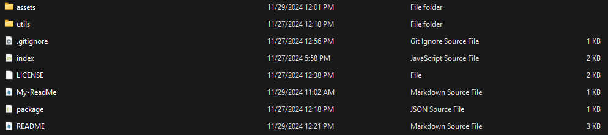

# My Readme Template Generator

## Description

This project is designed to make building a ReadMe file easy and quicker. As a programer I understand that not all programers like some of the none programing parts of the projects such as the ReadMe file. That is why I made this project to make it easier for programers to quickly generate their ReadMe files so they can quickly move on to the heart of their project's and start coding. Making this project was also good practice for getting a better understanding of how a ReadMe file should look and I highly recommend anyone that wants to get better at making a ReadMe file should try making there own version of this project as well.

## Table of Contents

- [Installation](#installation)
- [Usage](#usage)
- [Credits](#credits)
- [License](#license)

## Installation

In order to install this project on your own computer copy either all the files from the repository or use your git bash terminal to clone the repository down to your own machine. Once you have all the files for the project you will then need to install [node js](https://nodejs.org/en) if you don't have that already.

## Usage

Once you have both the My-Readme-Template-Generator project on your computer and node js downloaded run your terminal and navigate to the projects folder. You should then open up the directory for this project and the layout should look something like this:   
  
There should also be a generateMarkdown.js file in utils folder.
If for some reason it is not orginized right try rearranging the files, re-pulling the project or clonning the project again to fix it. If there are no problems then in your computers terminal navigate to the project and open it up and run the command: "node index.js". After doing this the project should begin to run and ask you for info to generate your ReadMe file. The file should appear in your project as "My-ReadMe.md". Be warned that everytime you run the project and finsh answering the prompts the project will overide the current "My-ReadMe.md" file so move or copy it out before then.

For a walkthrough of how to use the application [Click Here](https://drive.google.com/file/d/1bT8SY0dOUtcK0CNuMRFuQ0rvAM_cuNJt/view).

## Credits

Project Designer: Kalab Smith
- [K-Lab-Code](https://github.com/K-Lab-Code)
- [kalabsb@me.com](mailto:kalabsb@me.com)

As a template for my ReadMe file and inspiration for ReadMe file generator I used this blogs post: [Professional ReadMe File By The Ful-Stack Blog](https://coding-boot-camp.github.io/full-stack/github/professional-readme-guide)

## License

Distributed under the MIT License. See LICENSE.txt for more information.
